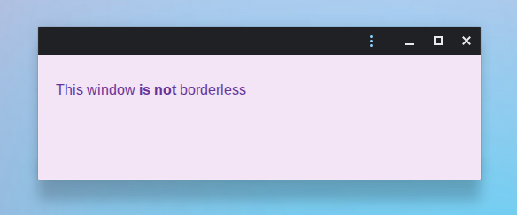
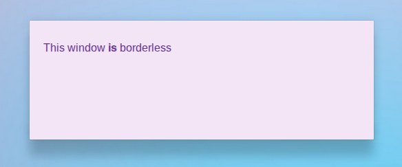
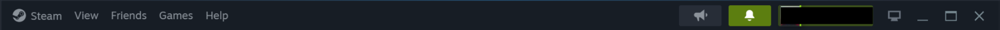
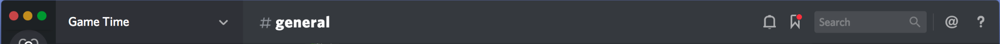

# Unframed Windows Explainer

## Introduction

This explainer proposes the new `unframed` display mode assignable in the
[Web Application Manifest](https://www.w3.org/TR/appmanifest/) to control the
so-called unframed windows feature. We also extend `display_override` to allow
different display modes according to the window URL.

The unframed windows feature enables
[Isolated Web App](https://github.com/WICG/isolated-web-apps) (IWA) developers
to fully control the content of app windows. To that end, when in unframed
display mode the user agent displays no frame around the app window, including
default decoration like borders, title bar, or minimize/maximize/close control
buttons. Common interaction normally led by the user, like closing the window or
dragging the title bar, is instead expected to be implemented by the IWA
programmatically where applicable.

Here is what an example app window normally looks like:



And here is what the same window looks like when it is unframed:



Access to unframed windows is restricted to IWAs primarily because of the risks
associated with spoofing content from other apps or even the user agent itself.

## Goals

*   Allow developers to have full control over the appearance of the app window,
    including the title bar area.
*   Allow developers to mix regular windows alongside unframed windows.

## Non-goals

*   Allow users to control which windows are unframed, for example in app
    settings.
*   Enable unframed windows outside IWAs.
*   Support mobile OSs, as there is little distinction from full-screen mode.

## Existing alternatives

There are no true alternatives developers can use to implement unframed windows.
The closest options are window controls overlay and fullscreen display modes.

### Window controls overlay

Developers can declare a
[`display`](https://developer.mozilla.org/en-US/docs/Web/Progressive_web_apps/Manifest/Reference/display)
or
[`display_override`](https://developer.mozilla.org/en-US/docs/Web/Progressive_web_apps/Manifest/Reference/display_override)
in the web app manifest to control how the app window is displayed, for example
to be full screen, or in standalone mode.

All existing display modes have some form of title bar in desktop operating
systems. The most minimal option is
[`window-controls-overlay`](https://developer.mozilla.org/en-US/docs/Web/API/Window_Controls_Overlay_API)
(WCO). In this mode the title bar is reduced to an overlay, but is still present
nevertheless.

For instance, consider a VDI web app using `window-controls-overlay` to stream
an application running in a remote machine. The WCO overlay looks out of place
above the remote OS title bar. This solution is sub-par compared to what can be
achieved with native OS apps.


Another limitation of this approach is it declares the display mode for the
entire app. We intend unframed windows to be more flexible and allow apps to use
regular windows when needed.

### Fullscreen

Another relevant `display` option available to developers is
[`fullscreen`](https://developer.mozilla.org/en-US/docs/Web/Progressive_web_apps/Manifest/Reference/display#fullscreen).
In this display mode the browser hides all UI elements and maximizes the window
for the entire display area.

This can't replace unframed windows because:

*   The app window is maximized when in fullscreen. We want unframed windows to
    be of various sizes.

*   The `fullscreen` display mode is not available outside of mobile.

## What apps could benefit?

Some example use-cases for unframed are:

### Custom title bars

Developers may want to fully customize the title bar with their own style.
Examples from native apps:

*   Steam on Windows



*   Discord on macOS



### Fully app-controlled windows

Developers may want to have a subset of windows that are controlled fully
programmatically by the app, not by the user. For example, a drop-down menu or
tooltip with no draggable area or minimize button. The app decides its placement
and when to create or close it.

### Streamed app windows

Virtual Desktop Infrastructure (VDI) providers may stream a remote window to the
local device. The remote window already has a title bar, and the VDI app wants
to avoid drawing a second title bar above it.

## Proposed solution

In its simplest form a developer configures its web app manifest to use unframed
windows as follows:

```json
{
  // 1.  Request the `window-management` permission policy.
  "permissions_policy": { "window-management": ["self"] },
  "display": "standalone",
  // 2.  Add `unframed` to the `display_override` list.
  "display_override": ["unframed"],
  ...
}
```

This works as one would expect. That is, once the display mode is set in
`display_override`, all windows of the app will have this display mode if the
user agent supports it.

To further declare which windows should be unframed, developers can provide a
JSON object to `display_override` instead of a string like so:

```json
{
  // 1.  Request the `window-management` permission policy.
  "permissions_policy": { "window-management": ["self"] },
  "display": "standalone",
  // 2.  Add a JSON object to the `display_override` list.
  "display_override": [
    {
      // 3.  Set `display` to `unframed` in the object.
      "display": "unframed",
      // 4.  Set `url_patterns` to the URLs intended to be unframed.
      "url_patterns": [
        "/some/path/*",
        { "pathname": "/some/other/path/*" }
      ]
    }
  ],
  ...
}
```

### Manifest changes

There are two manifest changes required in this proposal:

1.  To introduce the `unframed` display mode.

2.  And to allow JSON objects in `display_override`.

Change (2) is based on
[this previous proposal](https://github.com/WICG/display-override/blob/main/explainer.md#custom-display-mode-names-with-display-modifiers-style-specification),
and leverages the existing `display_override` mechanism so developers can
control an app's display experience in a more customizable way.

An object entry in `display_override` can declare its `display` and the
`url_patterns` where the display should apply.

The `url_patterns` list accepts URL patterns as described in the
[URL pattern spec](https://urlpattern.spec.whatwg.org) and describes the set of
URLs that should be unframed. The set of accepted URL patterns is restricted to
exclude patterns containing regular expressions. This avoids security concerns
and follows other specs like
[service worker routes](https://w3c.github.io/ServiceWorker/#verify-router-rule-algorithm).

This mechanism with `display_override` and `url_patterns` is not specific to the
new `unframed` display mode. The same idea can be leveraged by other display
modes where it makes sense.

### Window creation

If a new IWA window is created with a URL that matches one of the unframed
`url_patterns`, the window should be created in unframed mode from the very
beginning without flicker. That is, the new window must not show another visible
display mode before it switches to unframed.

### Window navigation or URL change

Once an unframed window has been created, its display mode is fixed for the
lifetime of the window.

That is, as a user navigates to and from URLs matching `url_patterns`, the
window does not transition in and out of the unframed display mode according to
the current URL. The window remains on the display mode it was created with.

Besides a full navigation, the same behavior happens if the app changes its URL
dynamically via APIs such as
[`history.pushState()`](https://developer.mozilla.org/en-US/docs/Web/API/History/pushState)
or
[`window.location`](https://developer.mozilla.org/en-US/docs/Web/API/Window/location).

This decision was made to simplify the implementation and minimize potential UX
challenges to users. It may be revisited to allow dynamic changes in the future.

### Out-of-scope navigation

Within an IWA window, navigation to URLs that are outside the IWA's defined
scope (including cross-origin navigation) is not permitted. If the IWA attempts
such a navigation, the user agent will open a new, regular window for the
destination URL instead.

As unframed windows are only available for IWAs, it follows that an unframed
window cannot navigate across origins.

### CSS media query

Similarly to other display modes, unframed should be queryable with `@media`.
Example:

```css
@media (display-mode: unframed) {
  .example-class {
    margin: 5px;
  }
}
```

See the
[@media/display-mode documentation](https://developer.mozilla.org/en-US/docs/Web/CSS/@media/display-mode).

## Security & privacy considerations

### Spoofing risks

Giving developers control of the title bar enables them to spoof content in what
was previously a trusted, user agent-controlled region. To mitigate this threat,
the feature is only available for IWAs and gated behind a window management
permission granted by the user or via admin policies.

### Title bar indicators

User agents often use the title bar to display informative or critical
indicators to users. This can include information like the app origin or privacy
indicators, e.g. for camera and microphone access.

Since there is no title bar in unframed windows, those indicators will need to
be shown elsewhere. The specific location to display those indicators is
OS-dependent and to be decided by the user agent.

Common options are to move them to the shelf or to settings. For example Chrome
on ChromeOS displays the origin in the app settings and privacy indicators on
the OS shelf:


## Related proposals

### Additional windowing controls

An unframed window has no title bar and therefore no user agent controls to
minimize, maximize, close, or drag the window. Developers need to be able to do
those operations themselves when necessary.

[Additional Windowing Controls](https://github.com/ivansandrk/additional-windowing-controls/blob/main/awc-explainer.md)
solves this problem and makes such APIs available to developers.

